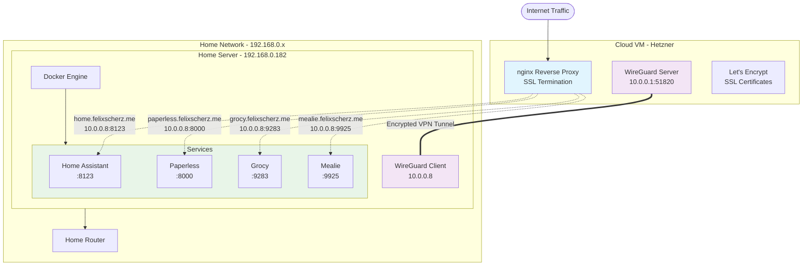

# homeassistant

## Setting up homekit bridge

In order to pair iOS devices with homeassistant I need to setup a [HomeKit
Bridge](https://www.home-assistant.io/integrations/homekit/) integration. iOS devices will try to discover
homeassistant using [mDNS](https://en.wikipedia.org/wiki/Multicast_DNS) querying `homeassistant.local`. If your network
setup does not support those kind of queries you won't be able to integrate iOS devices with homeassistant.

Since my network uses an [OpenWRT](https://openwrt.org) router, I had to setup an `avahi-daemon` in order to support
mDNS queries on my local network. After following this guide: https://blog.christophersmart.com/2020/03/30/resolving-mdns-across-vlans-with-avahi-on-openwrt/
I finally was able to call `ping homeassistant.local` and resolve to my homeassistant instance.

## Network Architecture

### Key Components

- **Cloud VM**: Runs nginx reverse proxy with SSL termination and WireGuard VPN server
- **Home Server**: Hosts all services in Docker containers, connected via WireGuard client
- **VPN Tunnel**: Encrypted connection (10.0.0.0/24) allows proxy to reach home services
- **No SSH Tunnels**: Eliminated complex SSH reverse tunnels for simplified, reliable connectivity

All application services run locally on the home server, accessible to the internet through the cloud proxy via secure VPN tunnel.

## Security

### Multi-Layer Security Architecture

This setup implements defense-in-depth security with multiple layers of protection:

#### 1. **SSL/TLS Encryption**
- Let's Encrypt certificates provide end-to-end encryption for all external traffic
- HSTS headers enforce HTTPS connections and prevent protocol downgrade attacks
- Certificate auto-renewal via certbot ensures continuous protection

#### 2. **VPN Tunnel Protection**
- WireGuard provides military-grade encryption for all proxy-to-server communication
- Only the VPN tunnel endpoint (port 51820) is exposed on the cloud VM
- All service traffic flows through the encrypted tunnel, never directly exposed

#### 3. **Web Application Security**
- **Security Headers**: Comprehensive HTTP security headers protect against common web attacks:
  - `X-Frame-Options`: Prevents clickjacking attacks
  - `X-Content-Type-Options`: Blocks MIME sniffing attacks
  - `X-XSS-Protection`: Enables browser XSS filtering
  - `Content-Security-Policy`: Restricts resource loading to prevent injection attacks
  - `Referrer-Policy`: Controls referrer information leakage
- **Rate Limiting**: Multi-tier rate limiting prevents DoS attacks:
  - General traffic: 10 requests/second with burst capacity
  - API endpoints: 5 requests/second for sensitive operations
  - File uploads: 2 requests/second for resource-intensive operations

#### 4. **Network Segmentation**
- Cloud VM only runs nginx reverse proxy (minimal attack surface)
- All services isolated on home network behind NAT and firewall
- VPN provides controlled access tunnel with restricted IP ranges

#### 5. **SSH Hardening**
- **Authentication Security**:
  - Password authentication disabled (SSH keys only)
  - Root login disabled for enhanced privilege separation
  - Maximum 3 authentication attempts before disconnect
- **Protocol Security**:
  - Only SSHv2 protocol allowed (SSHv1 is cryptographically broken)
  - Strong encryption ciphers: AES-256-GCM, ChaCha20-Poly1305
  - Secure key exchange: Curve25519, Diffie-Hellman Group 16
- **Session Hardening**:
  - 5-minute keepalive intervals with automatic disconnect
  - 60-second login timeout prevents hanging connections
  - Limited concurrent sessions (max 3 per user)
- **Attack Surface Reduction**:
  - X11 forwarding, TCP forwarding, and agent forwarding disabled
  - Compression disabled (prevents CRIME-style attacks)
  - DNS lookups disabled for faster connections
  - User environment variables blocked

#### 6. **Intrusion Prevention**
- **Fail2ban Protection**:
  - SSH brute force protection: 3 failed attempts → 1 hour ban
  - nginx attack prevention: HTTP auth failures, bad bots, proxy abuse
  - Log monitoring across `/var/log/auth.log` and nginx logs
  - Automatic IP blocking with configurable ban times
- **Behavioral Analysis**:
  - Monitors authentication patterns for anomalies
  - Escalating ban times for repeat offenders
  - Protection against distributed attacks from multiple IPs

#### 7. **Secrets Management**
- Ansible Vault encrypts all sensitive credentials and keys
- WireGuard keys stored securely and never transmitted in plaintext
- No hardcoded secrets in configuration files

### Security Monitoring Recommendations

For enhanced security monitoring, consider implementing:

- **Log aggregation**: Centralized logging for security event analysis
- **Advanced intrusion detection**: Beyond fail2ban, monitor for sophisticated attack patterns
- **Container security scanning**: Regular vulnerability assessments for Docker images
- **Automated security updates**: Keep all components patched
- **Security alerting**: Real-time notifications for security events

### Threat Model

**Protected Against:**
- DDoS attacks (rate limiting + cloud infrastructure)
- Web application attacks (security headers + WAF-like protections)
- Man-in-the-middle attacks (end-to-end encryption)
- Direct service exposure (VPN tunnel isolation)
- Credential theft (Ansible Vault encryption)
- SSH brute force attacks (fail2ban + hardened SSH configuration)
- Protocol downgrade attacks (forced modern crypto only)
- Session hijacking (secure session management)

**Additional Considerations:**
- Regular security audits and penetration testing
- Keep all services and dependencies updated
- Monitor logs for suspicious activity
- Implement backup and disaster recovery procedures
