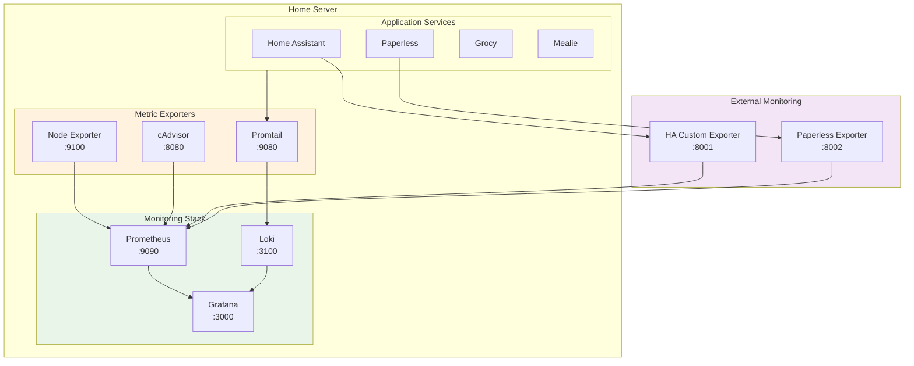

# homeassistant

## Setting up homekit bridge

In order to pair iOS devices with homeassistant I need to setup a [HomeKit
Bridge](https://www.home-assistant.io/integrations/homekit/) integration. iOS devices will try to discover
homeassistant using [mDNS](https://en.wikipedia.org/wiki/Multicast_DNS) querying `homeassistant.local`. If your network
setup does not support those kind of queries you won't be able to integrate iOS devices with homeassistant.

Since my network uses an [OpenWRT](https://openwrt.org) router, I had to setup an `avahi-daemon` in order to support
mDNS queries on my local network. After following this guide: https://blog.christophersmart.com/2020/03/30/resolving-mdns-across-vlans-with-avahi-on-openwrt/
I finally was able to call `ping homeassistant.local` and resolve to my homeassistant instance.

## Network Architecture

### Key Components

- **Cloud VM**: Runs nginx reverse proxy with SSL termination and WireGuard VPN server
- **Home Server**: Hosts all services in Docker containers, connected via WireGuard client
- **VPN Tunnel**: Encrypted connection (10.0.0.0/24) allows proxy to reach home services
- **No SSH Tunnels**: Eliminated complex SSH reverse tunnels for simplified, reliable connectivity

All application services run locally on the home server, accessible to the internet through the cloud proxy via secure VPN tunnel.

## Security

### Multi-Layer Security Architecture

This setup implements defense-in-depth security with multiple layers of protection:

#### 1. **SSL/TLS Encryption**
- Let's Encrypt certificates provide end-to-end encryption for all external traffic
- HSTS headers enforce HTTPS connections and prevent protocol downgrade attacks
- Certificate auto-renewal via certbot ensures continuous protection

#### 2. **VPN Tunnel Protection**
- WireGuard provides military-grade encryption for all proxy-to-server communication
- Only the VPN tunnel endpoint (port 51820) is exposed on the cloud VM
- All service traffic flows through the encrypted tunnel, never directly exposed

#### 3. **Web Application Security**
- **Security Headers**: Comprehensive HTTP security headers protect against common web attacks:
  - `X-Frame-Options`: Prevents clickjacking attacks
  - `X-Content-Type-Options`: Blocks MIME sniffing attacks
  - `X-XSS-Protection`: Enables browser XSS filtering
  - `Content-Security-Policy`: Restricts resource loading to prevent injection attacks
  - `Referrer-Policy`: Controls referrer information leakage
- **Rate Limiting**: Multi-tier rate limiting prevents DoS attacks:
  - General traffic: 10 requests/second with burst capacity
  - API endpoints: 5 requests/second for sensitive operations
  - File uploads: 2 requests/second for resource-intensive operations

#### 4. **Network Segmentation**
- Cloud VM only runs nginx reverse proxy (minimal attack surface)
- All services isolated on home network behind NAT and firewall
- VPN provides controlled access tunnel with restricted IP ranges

#### 5. **SSH Hardening**
- **Authentication Security**:
  - Password authentication disabled (SSH keys only)
  - Root login disabled for enhanced privilege separation
  - Maximum 3 authentication attempts before disconnect
- **Protocol Security**:
  - Only SSHv2 protocol allowed (SSHv1 is cryptographically broken)
  - Strong encryption ciphers: AES-256-GCM, ChaCha20-Poly1305
  - Secure key exchange: Curve25519, Diffie-Hellman Group 16
- **Session Hardening**:
  - 5-minute keepalive intervals with automatic disconnect
  - 60-second login timeout prevents hanging connections
  - Limited concurrent sessions (max 3 per user)
- **Attack Surface Reduction**:
  - X11 forwarding, TCP forwarding, and agent forwarding disabled
  - Compression disabled (prevents CRIME-style attacks)
  - DNS lookups disabled for faster connections
  - User environment variables blocked

#### 6. **Intrusion Prevention**
- **Fail2ban Protection**:
  - SSH brute force protection: 3 failed attempts → 1 hour ban
  - nginx attack prevention: HTTP auth failures, bad bots, proxy abuse
  - Log monitoring across `/var/log/auth.log` and nginx logs
  - Automatic IP blocking with configurable ban times
- **Behavioral Analysis**:
  - Monitors authentication patterns for anomalies
  - Escalating ban times for repeat offenders
  - Protection against distributed attacks from multiple IPs

#### 7. **Secrets Management**
- Ansible Vault encrypts all sensitive credentials and keys
- WireGuard keys stored securely and never transmitted in plaintext
- No hardcoded secrets in configuration files

### Security Monitoring Recommendations

For enhanced security monitoring, consider implementing:

- **Log aggregation**: Centralized logging for security event analysis
- **Advanced intrusion detection**: Beyond fail2ban, monitor for sophisticated attack patterns
- **Container security scanning**: Regular vulnerability assessments for Docker images
- **Automated security updates**: Keep all components patched
- **Security alerting**: Real-time notifications for security events

### Threat Model

**Protected Against:**
- DDoS attacks (rate limiting + cloud infrastructure)
- Web application attacks (security headers + WAF-like protections)
- Man-in-the-middle attacks (end-to-end encryption)
- Direct service exposure (VPN tunnel isolation)
- Credential theft (Ansible Vault encryption)
- SSH brute force attacks (fail2ban + hardened SSH configuration)
- Protocol downgrade attacks (forced modern crypto only)
- Session hijacking (secure session management)

**Additional Considerations:**
- Regular security audits and penetration testing
- Keep all services and dependencies updated
- Monitor logs for suspicious activity
- Implement backup and disaster recovery procedures

## Monitoring & Observability

### Overview

The infrastructure includes comprehensive monitoring using the modern observability stack:

- **Prometheus**: Metrics collection and alerting engine
- **Grafana**: Visualization dashboards and alerting interface
- **Loki**: Log aggregation and analysis
- **Promtail**: Log shipping agent
- **Node Exporter**: System metrics collection
- **cAdvisor**: Container metrics collection

### Architecture

### Key Features

#### **Metrics Collection**
- **System Metrics**: CPU, memory, disk, network usage via Node Exporter
- **Container Metrics**: Docker container resource usage, restarts, health via cAdvisor
- **Application Metrics**: Custom exporters for Home Assistant and Paperless services
- **Infrastructure Metrics**: Network connectivity, service uptime, response times

#### **Log Aggregation**
- **Centralized Logging**: All container logs collected by Promtail and stored in Loki
- **Structured Querying**: LogQL queries for advanced log analysis and debugging
- **Retention Policies**: Configurable log retention to manage storage usage

#### **Alerting System**
- **Multi-tier Alerts**: Critical, warning, and info level alerts based on severity
- **Comprehensive Coverage**:
  - Node down detection (5-minute threshold)
  - High CPU usage (>80% for 10+ minutes)
  - High memory usage (>90% for 5+ minutes)
  - Low disk space (<10% available)
  - Container restart monitoring
  - Container memory limits (>90% of allocation)

#### **Visualization**
- **Pre-built Dashboards**: Docker containers and infrastructure overview
- **Real-time Monitoring**: Live metrics with configurable refresh intervals
- **Historical Analysis**: Trending and capacity planning capabilities

### Access & Configuration

#### **Dashboard Access**
- **Grafana**: Available at `http://server:3000` (or via reverse proxy)
- **Prometheus**: Available at `http://server:9090` for direct metric queries
- **Default Credentials**: Configured via Ansible variables

#### **Data Sources**
- **Prometheus**: `http://prometheus:9090` (configured automatically)
- **Loki**: `http://loki:3100` (configured automatically)

#### **Alert Routing**
- **Prometheus Alertmanager**: Built-in alert evaluation and routing
- **Grafana Alerts**: Visual alert management and notification channels
- **Extensible**: Ready for integration with external notification systems (email, Slack, etc.)

### Maintenance

#### **Storage Management**
- **Metrics Retention**: 15-day default retention for Prometheus data
- **Log Retention**: 7-day default retention for Loki logs
- **Volume Management**: Persistent Docker volumes for data durability

#### **Performance Tuning**
- **Resource Limits**: Configured memory and CPU limits for all monitoring containers
- **Scrape Intervals**: Optimized collection intervals (15s default) for balance of accuracy and performance
- **Query Optimization**: Efficient queries and dashboard design to minimize resource usage

### Extending Monitoring

#### **Adding New Exporters**
1. Deploy exporter as Docker container or system service
2. Add scrape target to `prometheus-config.yml.j2`
3. Create custom dashboards in Grafana
4. Define relevant alert rules in `prometheus-alert-rules.yml.j2`

#### **Custom Metrics**
- Application-specific metrics via custom exporters (examples: Home Assistant, Paperless)
- Integration with service APIs for business logic monitoring
- Support for push-based metrics via Prometheus Pushgateway (optional)

This monitoring setup provides comprehensive visibility into system health, performance trends, and early warning for potential issues across the entire home infrastructure.
